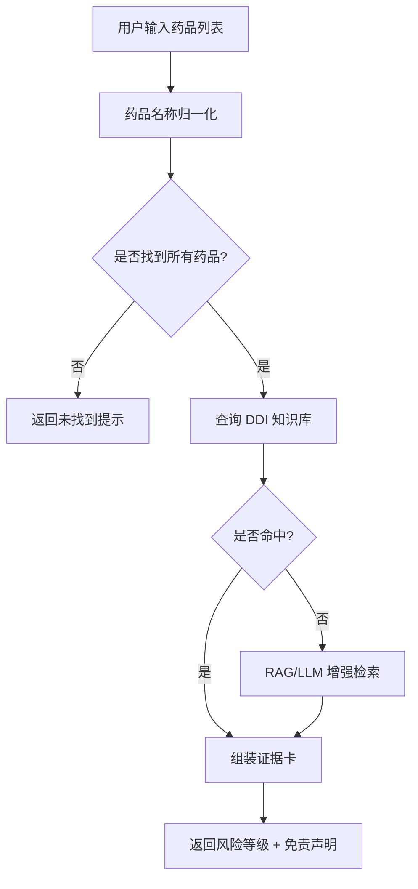
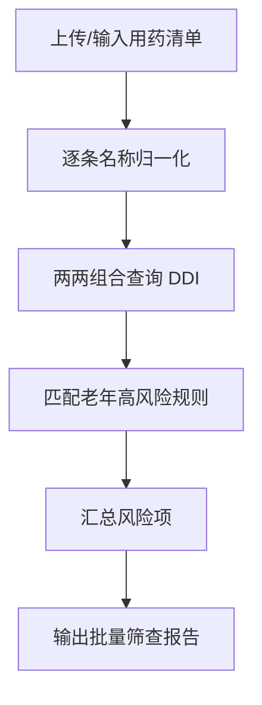

# 小药安 / MedSafe-Helper 产品需求文档

## 1. 产品概述

**小药安（MedSafe-Helper）** 是一款面向大众与家庭照护者的用药安全科普工具，聚焦药物-药物相互作用、食物-药物冲突、药品说明书大白话解读、老年人用药清单批量风险筛查四大核心场景。产品**不提供诊断、处方或剂量调整建议**，所有输出均以风险提示与循证信息为主，并附带明确免责声明。

- **目标用户**：慢性病患者及家属、老年人照护者、普通公众、健康科普读者。
- **产品价值**：降低因用药信息碎片化导致的误用风险，通过结构化知识库 + RAG + LLM 大白话解读，让用药安全信息触手可及。

## 2. 核心功能

### 2.1 用户角色

| 角色 | 使用方式 | 核心权限 |
|------|----------|----------|
| 普通用户 | 无需注册，直接访问 Studio / Skill / MCP | 查询相互作用、解读说明书、筛查清单 |
| 开发者 / Agent | 接入 MCP Server 或加载 Skill | 通过工具调用复用用药安全能力 |

### 2.2 功能模块

1. **药物相互作用查询**：输入 2~10 个药品名，返回风险等级、作用机制、建议与来源。
2. **食物-药物冲突查询**：输入药品 + 食物/饮品，返回冲突说明与注意事项。
3. **说明书大白话解读**：输入药品名，选择章节，输出通俗易懂的解读。
4. **老年用药清单批量筛查**：上传 CSV 或手动输入清单，批量返回风险组合与高风险项。

### 2.3 页面/功能详情

| 页面/入口 | 模块 | 功能描述 |
|-----------|------|----------|
| Studio 首页 | 免责声明 Banner | 常驻顶部，强调工具不替代医生/药师建议 |
| 药物相互作用 Tab | 药品输入、风险卡片、证据列表 | 支持多药品输入，返回风险等级与机制 |
| 食物-药物冲突 Tab | 药品+食物输入、冲突说明 | 查询常见食物/饮品与药物的冲突 |
| 说明书解读 Tab | 药品名+章节选择、大白话输出 | 将说明书专业文本转为通俗解释 |
| 老年清单筛查 Tab | CSV 上传/手动输入、批量结果 | 输出高风险组合与注意事项 |
| Skill / MCP | JSON 工具调用 | 供 Agent 与 IDE 调用统一用药安全能力 |

## 3. 核心流程

### 3.1 药物相互作用查询流程

用户进入 Studio → 输入多个药品名 → 系统调用名称归一化 → 查询 SQLite 知识库中的 DDI 数据 → 如未命中则调用 RAG/LLM 增强 → 返回结构化风险卡片（等级、机制、来源、免责声明）。

### 3.2 老年清单批量筛查流程

用户上传/输入用药清单 → 系统逐条归一化 → 两两组合查询 DDI 与老年风险规则 → 汇总所有中高风险项 → 输出批量筛查报告。

## 4. 用户界面设计

### 4.1 设计风格

- **整体调性**：医疗专业感 + 亲和可信。避免过度医疗冰冷感，采用温和、清晰的视觉语言。
- **主色调**：
  - 主色：#0D9488（青绿色，代表安全、健康）
  - 辅助色：#F0FDFA（浅青背景）、#134E4A（深青文字）
  - 风险色：禁忌 #DC2626、高 #EA580C、中 #CA8A04、低 #2563EB、无 #16A34A
- **按钮风格**：圆角 8px，主按钮使用实心青绿，次级按钮使用描边样式。
- **字体**：
  - 标题：系统默认无衬线字体加粗，中文优先使用 "PingFang SC"/"Microsoft YaHei"
  - 正文：1rem，行高 1.6，保证可读性
- **布局**：顶部导航/Tab 切换 + 主内容卡片，居中容器最大宽度 960px，桌面优先。
- **图标/插画**：使用简洁的医药相关图标（药丸、盾牌、放大镜），避免过于卡通。

### 4.2 页面设计概述

| 页面/Tab | 模块 | UI 元素 |
|----------|------|---------|
| 首页 | 免责声明 | 顶部固定 Banner，橙/黄色背景，醒目文字 |
| 药物相互作用 | 输入区 + 结果卡 | 标签式多药品输入、风险等级徽章、折叠证据列表 |
| 食物-药物冲突 | 双输入 + 说明卡 | 药品输入框、食物选择/输入框、冲突说明文本 |
| 说明书解读 | 输入 + 章节 + 输出 | 下拉选择章节、大白话文本区 |
| 老年清单筛查 | 输入/上传 + 报告 | CSV 上传区、表格展示风险项、导出提示 |

### 4.3 响应式

- **桌面优先**：默认布局为 960px 居中容器，Tab 横向排列。
- **移动端适配**：Tab 改为可滚动横向或折叠菜单，输入框全宽，风险卡片垂直堆叠。
- **触控优化**：按钮最小点击区域 44px，输入框聚焦状态明显。

### 4.4 动效与交互

- 页面加载：内容区域淡入上浮（fade-in + translateY），持续 300ms， ease-out。
- Tab 切换：内容区淡入淡出，避免生硬跳转。
- 风险卡片：根据风险等级左侧带彩色竖条，hover 时轻微阴影提升。
- 结果加载：提交后显示骨架屏或加载动画，增强等待反馈。
-  disclaimer 横幅：可折叠但不完全关闭，始终保留一行提示。
