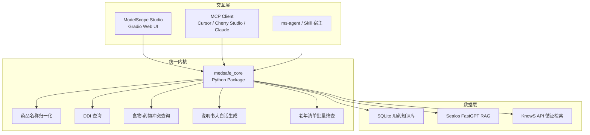
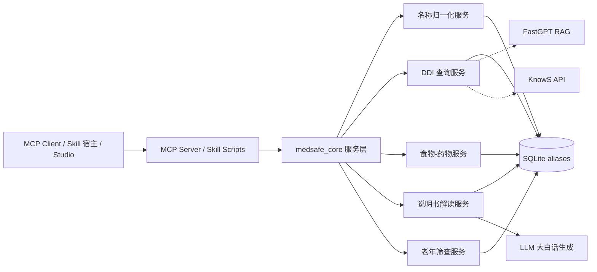
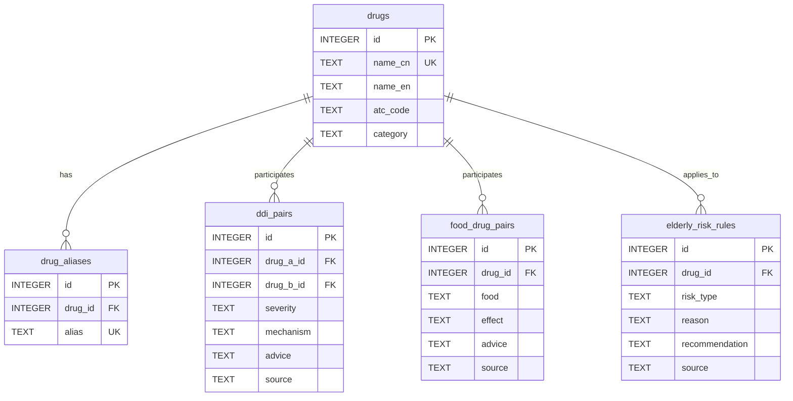

# 小药安 / MedSafe-Helper 技术架构文档

## 1. 架构设计

采用"统一领域内核 + 多形态封装"的分层架构：



## 2. 技术选型

- **统一内核**：Python 3.10+，包名 `medsafe_core`
- **Studio 前端**：Gradio 5.x，单文件 `app.py`，监听 `0.0.0.0:7860`
- **MCP Server**：Python + FastMCP，包名 `mcp-medsafe`
- **Skill**：ModelScope Skill 规范，`SKILL.md` + `scripts/` + `resources/`
- **数据库**：SQLite 3（本地结构化知识库 `medsafe_kg.db`）
- **名称匹配**：`rapidfuzz` 模糊匹配，阈值 0.75
- **LLM 增强**：DashScope / OpenAI 兼容 API（用于说明书大白话生成）
- **部署**：ModelScope 创空间 + PyPI + ModelScope MCP 广场 / Skills 中心

## 3. 路由/入口定义

| 入口 | 路径/方式 | 用途 |
|------|-----------|------|
| Studio Web UI | `/` | Gradio 主界面，包含 4 个 Tab |
| MCP Server STDIO | `mcp-medsafe` 命令 | 本地 IDE/Agent 接入 |
| MCP Server SSE | `/sse` | 远程 Agent 接入 |
| Skill 调用 | `medsafe-helper` Skill | ms-agent 自然语言触发 |
| Core 包导入 | `from medsafe_core import ...` | 开发者直接调用 |

## 4. API 定义

### 4.1 统一返回结构

```json
{
  "risk_level": "高",
  "summary": "阿司匹林与华法林联用可能增加出血风险，需密切监测。",
  "evidence": [
    {
      "type": "ddi",
      "drug_a": "阿司匹林",
      "drug_b": "华法林",
      "severity": "高",
      "mechanism": "抗血小板与抗凝作用叠加",
      "source": "DrugBank"
    }
  ],
  "disclaimer": "本结果仅供参考，具体用药请遵医嘱。"
}
```

### 4.2 核心函数签名

```python
# 名称归一化
normalize_drug_name(name: str) -> str | None

# 药物相互作用查询
check_drug_interactions(drugs: list[str]) -> InteractionResult

# 食物-药物冲突查询
check_food_drug_interaction(drug: str, food: str) -> InteractionResult

# 说明书大白话解读
explain_drug_label(drug: str, section: str | None = None) -> ExplanationResult

# 老年用药清单批量筛查
screen_elderly_medications(meds: list[str]) -> ScreeningResult
```

## 5. 服务端架构



## 6. 数据模型

### 6.1 ER 图



### 6.2 建表 DDL

```sql
CREATE TABLE drugs (
    id INTEGER PRIMARY KEY AUTOINCREMENT,
    name_cn TEXT NOT NULL UNIQUE,
    name_en TEXT,
    atc_code TEXT,
    category TEXT
);

CREATE TABLE drug_aliases (
    id INTEGER PRIMARY KEY AUTOINCREMENT,
    drug_id INTEGER NOT NULL,
    alias TEXT NOT NULL UNIQUE,
    FOREIGN KEY (drug_id) REFERENCES drugs(id)
);

CREATE TABLE ddi_pairs (
    id INTEGER PRIMARY KEY AUTOINCREMENT,
    drug_a_id INTEGER NOT NULL,
    drug_b_id INTEGER NOT NULL,
    severity TEXT NOT NULL CHECK(severity IN ('禁忌','高','中','低','无')),
    mechanism TEXT,
    advice TEXT,
    source TEXT,
    FOREIGN KEY (drug_a_id) REFERENCES drugs(id),
    FOREIGN KEY (drug_b_id) REFERENCES drugs(id)
);

CREATE TABLE food_drug_pairs (
    id INTEGER PRIMARY KEY AUTOINCREMENT,
    drug_id INTEGER NOT NULL,
    food TEXT NOT NULL,
    effect TEXT,
    advice TEXT,
    source TEXT,
    FOREIGN KEY (drug_id) REFERENCES drugs(id)
);

CREATE TABLE elderly_risk_rules (
    id INTEGER PRIMARY KEY AUTOINCREMENT,
    drug_id INTEGER NOT NULL,
    risk_type TEXT NOT NULL,
    reason TEXT,
    recommendation TEXT,
    source TEXT,
    FOREIGN KEY (drug_id) REFERENCES drugs(id)
);
```

## 7. 安全与合规设计

- **System Prompt 强制约束**：禁止给出诊断、处方、剂量调整、停药/换药建议，必须附带免责声明。
- **输出关键词拦截**：对"停药"、"加量"、"减量"、"治愈"等敏感词进行提示或拦截。
- **名称白名单/归一化**：拒绝非药品输入，匹配失败明确提示"未找到该药品，请检查名称"。
- **证据溯源**：每条证据返回 `source` 字段，优先使用权威来源（DrugBank、NMPA 说明书、Beers Criteria）。
- **数据隔离**：Demo 仅使用合成示例数据，不处理真实患者数据。

## 8. 部署与交付

| 形态 | 交付方式 |
|------|----------|
| Core 包 | `pip install medsafe-core`，GitHub 仓库 |
| MCP Server | PyPI 包 `mcp-medsafe`，提交 ModelScope MCP 广场 |
| Skill | `SKILL.md` + 脚本，提交 ModelScope Skills 中心 |
| Studio | `app.py` + `requirements.txt` + `ms_deploy.json`，部署到 ModelScope 创空间 |

## 9. 目录结构

```
medsafe-helper/
├── .trae/documents/
│   ├── PRD.md
│   └── Technical-Architecture.md
├── medsafe_core/
│   ├── __init__.py
│   ├── db.py
│   ├── normalizer.py
│   ├── interaction.py
│   ├── food_drug.py
│   ├── label_explainer.py
│   ├── elderly_screen.py
│   └── data/
│       └── sample_data.py
├── medsafe_skill/
│   ├── SKILL.md
│   └── scripts/
│       ├── check_interaction.py
│       ├── check_food_drug.py
│       ├── explain_label.py
│       └── screen_elderly.py
├── medsafe_mcp/
│   ├── __init__.py
│   └── server.py
├── studio/
│   └── app.py
├── data/
│   └── medsafe_kg.db
├── tests/
├── README.md
├── requirements.txt
├── pyproject.toml
└── ms_deploy.json
```
